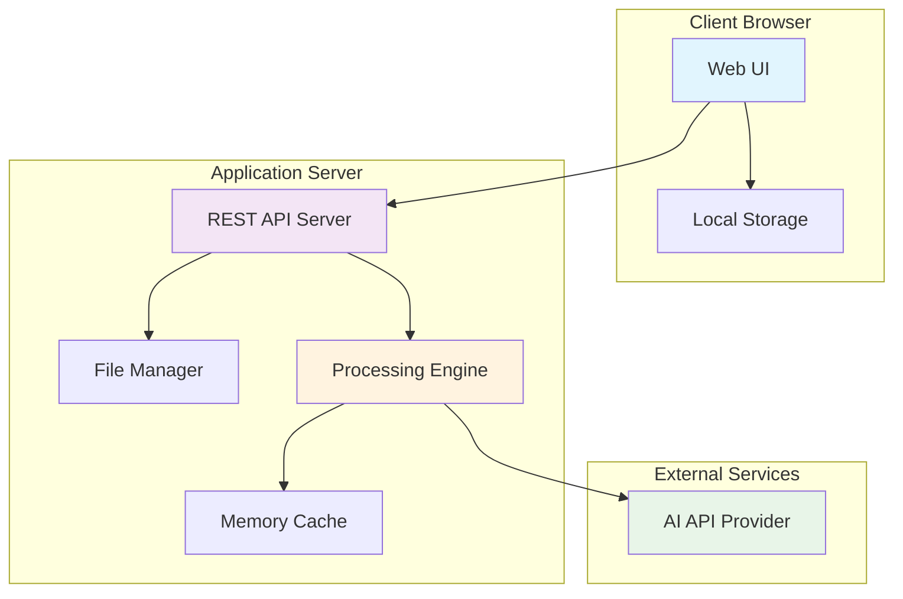
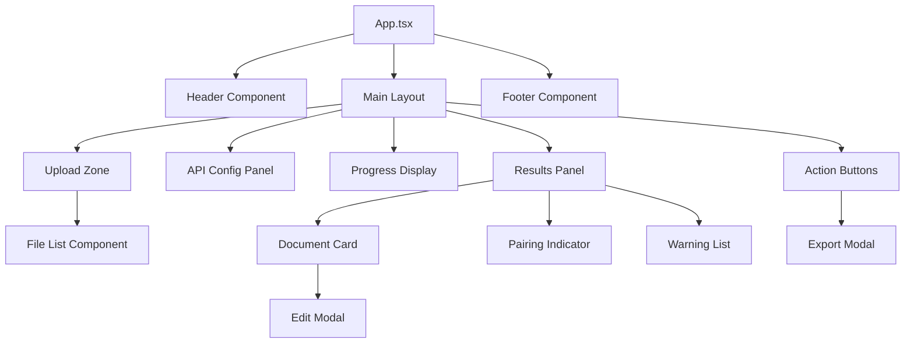
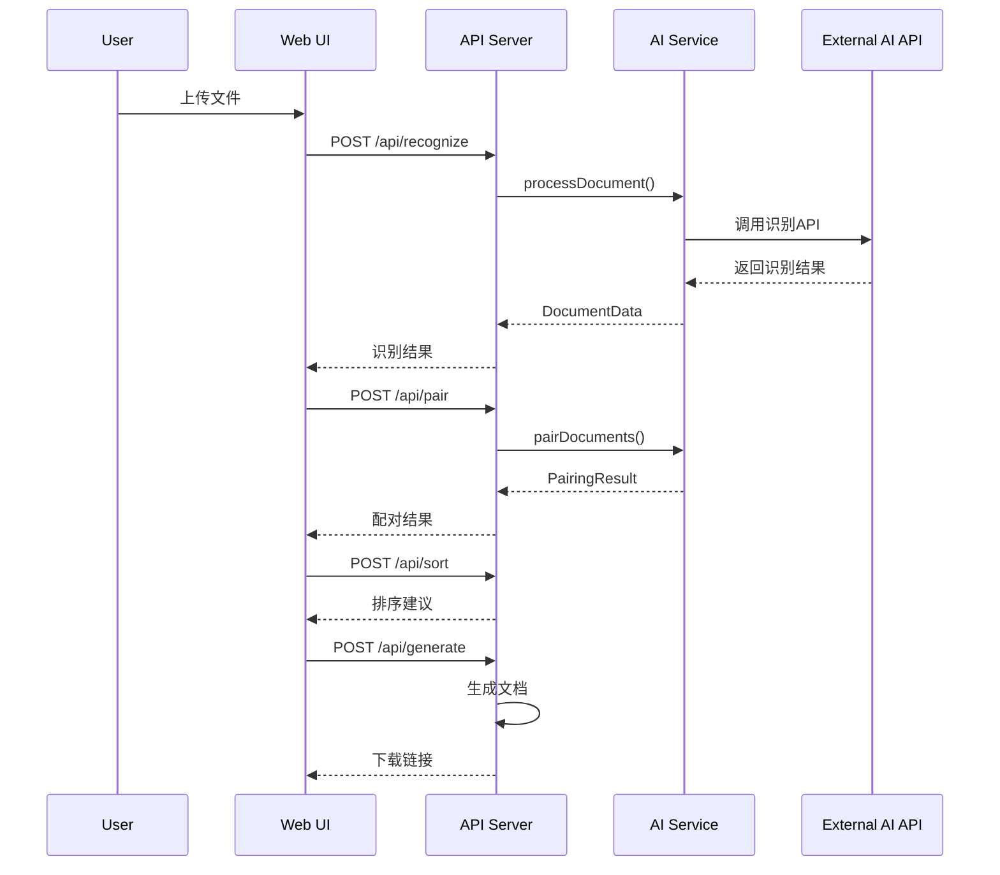

# Design Document

## Overview

AI发票整理助手是一个基于Web的单页应用（SPA），采用前端+后端分离的架构设计。系统通过调用外部AI API实现文档识别功能，所有数据处理在内存中完成，确保用户隐私安全。系统设计为轻量级部署，支持本地开发环境和低配置VPS生产环境。

### 核心设计原则

1. **隐私优先**: 所有敏感数据仅在内存中处理，不持久化到磁盘
2. **轻量级**: 内存使用限制在500MB以内，适配低配置环境
3. **跨平台**: 基于Web技术，支持所有主流操作系统和浏览器
4. **可扩展**: 支持多种AI API提供商，便于切换和扩展

## Architecture

### 系统架构图



### 技术栈选择

**前端技术栈:**
- **框架**: React 18 + TypeScript
- **状态管理**: Zustand (轻量级状态管理)
- **UI组件**: Tailwind CSS + Headless UI
- **文件处理**: File API + Canvas API
- **PDF处理**: PDF.js
- **拖拽功能**: React DnD

**后端技术栈:**
- **运行时**: Node.js 18+
- **框架**: Express.js
- **文件上传**: Multer (内存存储)
- **PDF处理**: pdf-poppler + sharp
- **文档生成**: jsPDF + html2canvas
- **跨平台**: pkg (打包为可执行文件)

**部署方案:**
- **开发环境**: npm run dev (前后端同时启动)
- **生产环境**: Docker容器 或 单文件可执行程序

## Components and Interfaces

### 前端组件架构



### 核心接口定义

#### 1. 文档数据模型

```typescript
interface DocumentData {
  id: string;
  fileName: string;
  fileType: 'pdf' | 'image';
  documentType: 'invoice' | 'trip_sheet';
  
  // 基础信息
  date: string;
  amount: number;
  description: string;
  confidence: number;
  
  // 发票专属字段
  invoiceNumber?: string;
  vendor?: string;
  taxAmount?: number;
  invoiceType?: 'taxi' | 'hotel' | 'train' | 'shipping' | 'toll' | 'consumables' | 'other';
  
  // 行程单专属字段
  tripDetails?: {
    platform: string;
    departure: string;
    destination: string;
    time: string;
    distanceKm: number;
  };
  
  // 处理状态
  status: 'pending' | 'processing' | 'completed' | 'error';
  errorMessage?: string;
}
```

#### 2. 配对结果模型

```typescript
interface PairingResult {
  pairs: Array<{
    invoiceId: string;
    tripSheetId: string;
    confidence: number;
    matchReason: string;
  }>;
  unmatchedInvoices: string[];
  unmatchedTripSheets: string[];
}
```

#### 3. API接口规范

```typescript
// 文档识别接口
POST /api/recognize
Content-Type: multipart/form-data
Body: { file: File }
Response: DocumentData

// 批量配对接口
POST /api/pair
Body: { documents: DocumentData[] }
Response: PairingResult

// 排序建议接口
POST /api/sort
Body: { documents: DocumentData[], pairs: PairingResult }
Response: { suggestedOrder: string[], grouping: Record<string, string[]> }

// 异常检测接口
POST /api/detect-anomalies
Body: { documents: DocumentData[] }
Response: { warnings: Warning[] }

// 文档生成接口
POST /api/generate
Body: { documents: DocumentData[], projectInfo: ProjectInfo }
Response: { pdfUrl: string, imageUrl: string, packageUrl: string }
```

### 后端服务架构

#### 1. 文件处理服务 (FileService)

```typescript
class FileService {
  // 文件上传和预处理
  async processUpload(file: Express.Multer.File): Promise<ProcessedFile>
  
  // 图片格式转换和优化
  async convertToBase64(file: ProcessedFile): Promise<string>
  
  // PDF转图片
  async pdfToImages(pdfBuffer: Buffer): Promise<Buffer[]>
  
  // 内存清理
  async clearMemory(): Promise<void>
}
```

#### 2. AI处理服务 (AIService)

```typescript
class AIService {
  // 文档识别
  async recognizeDocument(imageBase64: string, apiConfig: APIConfig): Promise<DocumentData>
  
  // 智能配对
  async pairDocuments(documents: DocumentData[]): Promise<PairingResult>
  
  // 异常检测
  async detectAnomalies(documents: DocumentData[]): Promise<Warning[]>
  
  // API连接测试
  async testConnection(apiConfig: APIConfig): Promise<boolean>
}
```

#### 3. 文档生成服务 (GeneratorService)

```typescript
class GeneratorService {
  // 生成PDF汇总表
  async generatePDFSummary(documents: DocumentData[], projectInfo: ProjectInfo): Promise<Buffer>
  
  // 生成图片报销单
  async generateImageReimbursement(documents: DocumentData[]): Promise<Buffer>
  
  // 打包文件
  async packageFiles(documents: DocumentData[], order: string[]): Promise<Buffer>
}
```

## Data Models

### 核心数据流



### 内存管理策略

```typescript
class MemoryManager {
  private cache = new Map<string, any>();
  private maxMemoryMB = 500;
  
  // 监控内存使用
  async monitorMemory(): Promise<void> {
    const usage = process.memoryUsage();
    if (usage.heapUsed > this.maxMemoryMB * 1024 * 1024) {
      await this.clearOldestEntries();
    }
  }
  
  // 清理过期数据
  async clearOldestEntries(): Promise<void> {
    // 按时间戳清理最旧的数据
  }
  
  // 会话结束清理
  async clearSession(sessionId: string): Promise<void> {
    // 清理特定会话的所有数据
  }
}
```

## Error Handling

### 错误分类和处理策略

#### 1. 文件处理错误

```typescript
enum FileErrorType {
  UNSUPPORTED_FORMAT = 'UNSUPPORTED_FORMAT',
  FILE_TOO_LARGE = 'FILE_TOO_LARGE',
  CORRUPTED_FILE = 'CORRUPTED_FILE',
  PROCESSING_FAILED = 'PROCESSING_FAILED'
}

class FileError extends Error {
  constructor(
    public type: FileErrorType,
    public fileName: string,
    message: string
  ) {
    super(message);
  }
}
```

#### 2. AI API错误

```typescript
enum AIErrorType {
  API_KEY_INVALID = 'API_KEY_INVALID',
  RATE_LIMIT_EXCEEDED = 'RATE_LIMIT_EXCEEDED',
  NETWORK_ERROR = 'NETWORK_ERROR',
  PARSING_ERROR = 'PARSING_ERROR'
}

class AIError extends Error {
  constructor(
    public type: AIErrorType,
    public retryable: boolean,
    message: string
  ) {
    super(message);
  }
}
```

#### 3. 错误恢复机制

```typescript
class ErrorRecovery {
  // 自动重试机制
  async retryWithBackoff<T>(
    operation: () => Promise<T>,
    maxRetries: number = 3
  ): Promise<T> {
    for (let i = 0; i < maxRetries; i++) {
      try {
        return await operation();
      } catch (error) {
        if (i === maxRetries - 1 || !this.isRetryable(error)) {
          throw error;
        }
        await this.delay(Math.pow(2, i) * 1000);
      }
    }
  }
  
  // 降级处理
  async fallbackProcessing(document: DocumentData): Promise<DocumentData> {
    // 当AI识别失败时，返回基础信息供用户手动编辑
    return {
      ...document,
      status: 'error',
      errorMessage: '自动识别失败，请手动编辑',
      confidence: 0
    };
  }
}
```

## Testing Strategy

### 测试层级

#### 1. 单元测试
- **覆盖范围**: 所有核心业务逻辑函数
- **工具**: Jest + Testing Library
- **重点**: 文档解析、配对算法、数据验证

#### 2. 集成测试
- **覆盖范围**: API接口、AI服务集成
- **工具**: Supertest + Mock AI API
- **重点**: 端到端数据流、错误处理

#### 3. 性能测试
- **覆盖范围**: 内存使用、处理速度
- **工具**: Artillery + 自定义监控
- **重点**: 低配置环境下的稳定性

### 测试数据准备

```typescript
// 测试用例数据
const testDocuments = {
  taxiInvoice: {
    fileName: 'taxi_invoice.jpg',
    expectedData: {
      documentType: 'invoice',
      invoiceType: 'taxi',
      amount: 219.67,
      date: '11/03'
    }
  },
  tripSheet: {
    fileName: 'trip_sheet.jpg',
    expectedData: {
      documentType: 'trip_sheet',
      amount: 219.67,
      tripDetails: {
        platform: '如祺出行',
        departure: '嘉兴电子商务产业园',
        destination: '菜鸟智谷产业园'
      }
    }
  }
};
```

### Mock AI API

```typescript
class MockAIService implements AIService {
  async recognizeDocument(imageBase64: string): Promise<DocumentData> {
    // 返回预定义的测试数据
    return testDocuments.taxiInvoice.expectedData;
  }
  
  async pairDocuments(documents: DocumentData[]): Promise<PairingResult> {
    // 模拟配对逻辑
    return {
      pairs: [{
        invoiceId: 'doc1',
        tripSheetId: 'doc2',
        confidence: 98,
        matchReason: '金额完全匹配(219.67)，日期相同(11/3)'
      }],
      unmatchedInvoices: [],
      unmatchedTripSheets: []
    };
  }
}
```

## Performance Optimization

### 内存优化策略

#### 1. 流式处理
```typescript
class StreamProcessor {
  async processLargeFile(file: File): Promise<DocumentData> {
    // 分块读取大文件，避免一次性加载到内存
    const chunks = await this.readFileInChunks(file);
    const processedChunks = [];
    
    for (const chunk of chunks) {
      const processed = await this.processChunk(chunk);
      processedChunks.push(processed);
      // 立即释放chunk内存
      chunk.buffer = null;
    }
    
    return this.combineResults(processedChunks);
  }
}
```

#### 2. 缓存策略
```typescript
class CacheManager {
  private lruCache = new Map<string, CacheEntry>();
  private maxCacheSize = 50; // 最多缓存50个文档结果
  
  async get(key: string): Promise<DocumentData | null> {
    const entry = this.lruCache.get(key);
    if (entry && !this.isExpired(entry)) {
      // 更新访问时间
      entry.lastAccessed = Date.now();
      return entry.data;
    }
    return null;
  }
  
  async set(key: string, data: DocumentData): Promise<void> {
    if (this.lruCache.size >= this.maxCacheSize) {
      this.evictLeastRecentlyUsed();
    }
    
    this.lruCache.set(key, {
      data,
      lastAccessed: Date.now(),
      createdAt: Date.now()
    });
  }
}
```

### 并发控制

```typescript
class ConcurrencyController {
  private maxConcurrent = 2; // 低配置环境限制并发数
  private activeRequests = 0;
  private queue: Array<() => Promise<any>> = [];
  
  async execute<T>(operation: () => Promise<T>): Promise<T> {
    return new Promise((resolve, reject) => {
      const task = async () => {
        try {
          this.activeRequests++;
          const result = await operation();
          resolve(result);
        } catch (error) {
          reject(error);
        } finally {
          this.activeRequests--;
          this.processQueue();
        }
      };
      
      if (this.activeRequests < this.maxConcurrent) {
        task();
      } else {
        this.queue.push(task);
      }
    });
  }
  
  private processQueue(): void {
    if (this.queue.length > 0 && this.activeRequests < this.maxConcurrent) {
      const nextTask = this.queue.shift();
      if (nextTask) nextTask();
    }
  }
}
```

## Security Considerations

### 数据安全

#### 1. 敏感数据处理
```typescript
class SecurityManager {
  // 敏感数据脱敏
  sanitizeDocumentData(data: DocumentData): DocumentData {
    return {
      ...data,
      // 脱敏处理敏感字段
      invoiceNumber: this.maskInvoiceNumber(data.invoiceNumber),
      vendor: this.maskVendorName(data.vendor)
    };
  }
  
  // 内存清理
  async secureMemoryCleanup(): Promise<void> {
    // 覆写敏感数据内存区域
    if (global.gc) {
      global.gc();
    }
  }
  
  // API密钥加密存储
  encryptApiKey(apiKey: string): string {
    // 使用浏览器内置的Web Crypto API加密
    return btoa(apiKey); // 简化示例，实际应使用更强的加密
  }
}
```

#### 2. 输入验证
```typescript
class InputValidator {
  validateFile(file: File): ValidationResult {
    const errors: string[] = [];
    
    // 文件类型检查
    const allowedTypes = ['image/jpeg', 'image/png', 'application/pdf'];
    if (!allowedTypes.includes(file.type)) {
      errors.push('不支持的文件类型');
    }
    
    // 文件大小检查
    const maxSize = 10 * 1024 * 1024; // 10MB
    if (file.size > maxSize) {
      errors.push('文件大小超过限制');
    }
    
    return { isValid: errors.length === 0, errors };
  }
  
  validateApiConfig(config: APIConfig): ValidationResult {
    const errors: string[] = [];
    
    if (!config.apiKey || config.apiKey.length < 10) {
      errors.push('API密钥格式无效');
    }
    
    if (!config.endpoint || !this.isValidUrl(config.endpoint)) {
      errors.push('API端点URL无效');
    }
    
    return { isValid: errors.length === 0, errors };
  }
}
```

## Deployment Strategy

### 开发环境部署

```bash
# 安装依赖
npm install

# 启动开发服务器
npm run dev

# 运行测试
npm test

# 构建生产版本
npm run build
```

### 生产环境部署

#### 1. Docker部署
```dockerfile
FROM node:18-alpine

WORKDIR /app

# 复制依赖文件
COPY package*.json ./
RUN npm ci --only=production

# 复制源代码
COPY . .

# 构建应用
RUN npm run build

# 暴露端口
EXPOSE 3000

# 启动应用
CMD ["npm", "start"]
```

#### 2. 单文件可执行程序
```json
{
  "scripts": {
    "build:exe": "pkg . --targets node18-linux-x64,node18-win-x64,node18-macos-x64 --output dist/ai-invoice-organizer"
  },
  "pkg": {
    "assets": ["public/**/*", "dist/**/*"],
    "outputPath": "dist"
  }
}
```

### 环境配置

```typescript
// config/environment.ts
export const config = {
  development: {
    port: 3000,
    maxMemoryMB: 1000,
    maxConcurrent: 4,
    logLevel: 'debug'
  },
  production: {
    port: process.env.PORT || 3000,
    maxMemoryMB: 500,
    maxConcurrent: 2,
    logLevel: 'info'
  }
};
```

## Monitoring and Logging

### 性能监控

```typescript
class PerformanceMonitor {
  private metrics = {
    memoryUsage: 0,
    processingTime: 0,
    apiCallCount: 0,
    errorCount: 0
  };
  
  async trackMemoryUsage(): Promise<void> {
    const usage = process.memoryUsage();
    this.metrics.memoryUsage = usage.heapUsed / 1024 / 1024; // MB
    
    if (this.metrics.memoryUsage > 400) {
      console.warn(`内存使用过高: ${this.metrics.memoryUsage}MB`);
    }
  }
  
  async trackProcessingTime(operation: string, duration: number): Promise<void> {
    this.metrics.processingTime = duration;
    console.log(`${operation} 耗时: ${duration}ms`);
  }
}
```

### 日志系统

```typescript
class Logger {
  private logLevel = process.env.LOG_LEVEL || 'info';
  
  info(message: string, meta?: any): void {
    if (this.shouldLog('info')) {
      console.log(`[INFO] ${new Date().toISOString()} ${message}`, meta);
    }
  }
  
  error(message: string, error?: Error): void {
    if (this.shouldLog('error')) {
      console.error(`[ERROR] ${new Date().toISOString()} ${message}`, error);
    }
  }
  
  private shouldLog(level: string): boolean {
    const levels = ['debug', 'info', 'warn', 'error'];
    return levels.indexOf(level) >= levels.indexOf(this.logLevel);
  }
}
```